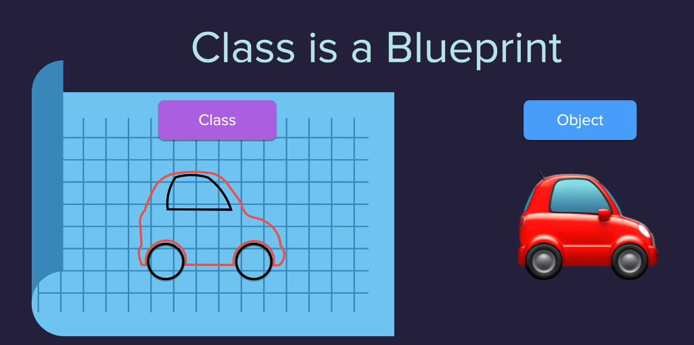

# 16 - OOPS

### Topics Covered

* Python Object Oriented Programming

###  Notes

1. Structure of a class

- Waiter `Class`
    
  - **has** `attribute`
      
  - **does** `method`
      
    - Waiter1 `object`
        
    - Waiter2 `object`

2. Pictorial representation of a class

      

### Resources

* [pypi](https://pypi.org/)

###  Materials

* [Python File - table](./016a.py)
* [Python File - coffee-machine](./016b.py)

---

**[Home](../README.md)**