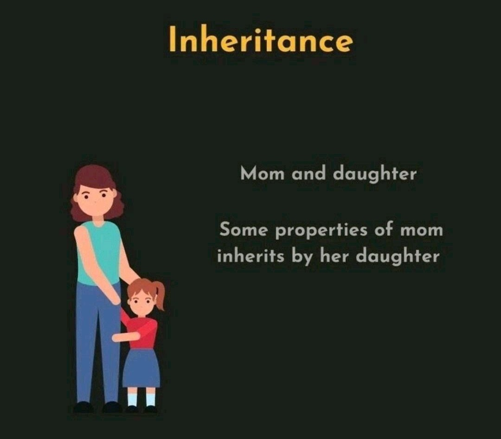
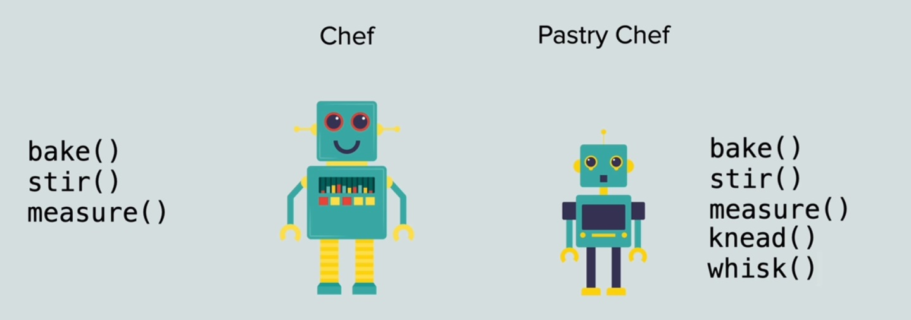

# 21 - Inheritance & Slicing

### Topics Covered

* Python Inheritance

* Python Slice Function

###  Notes

1. Structure of a class

- Chef `Class`
          
  - Chef1 `object`
      
  - Chef2 `object`

1. Pictorial representation of a class

      

      

###  Materials

* [Python File - snake-2](./main.py)

---

**[Home](../README.md)**